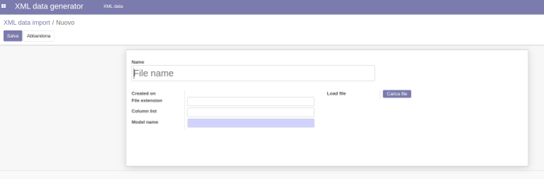
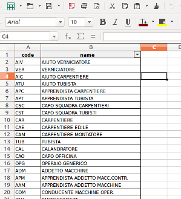
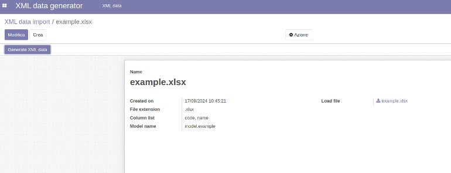
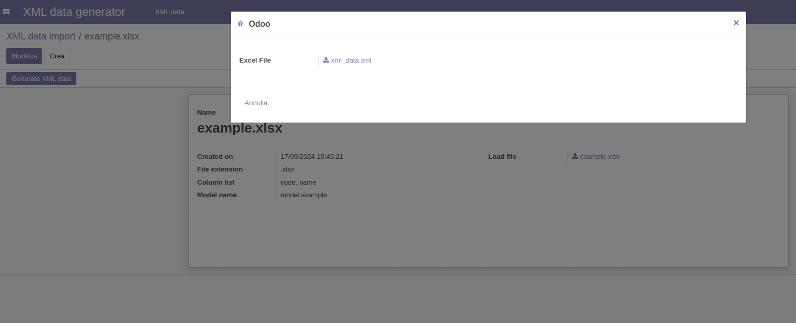
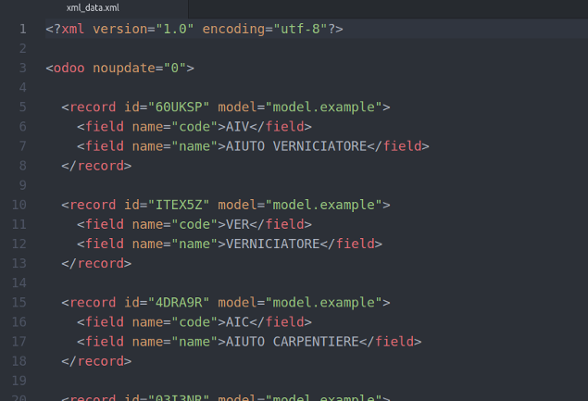

## Generate XML data file

Odoo 14.0

General informations
====================

### Odoo modules dependencies

* No dependencies

### Python dependencies

* No dependencies

Usage
=====

### Info
* generate_data_xml is a simple odoo tool that generate XML data file starting from a CSV or a XLSX file.
* Install “generate_data_xml” module. All necessary dependencies will be added automatically;

* Create new record to import
    

* This is an example file
    

* Upload the file and write the correct model name to generate xml data file
    

* Click the button "Generate XML data"
    

* This is the generated file
    

Credits
=======

Contributors
------------

* AngioC

Maintainer
----------

* AngioC

