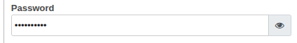
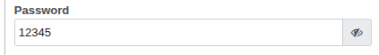

## Show/hide button near password field

Odoo 14.0

General information
===================

### Odoo modules dependencies

* No dependencies

### Python dependencies

* No dependencies

Usage
=====

### Info
* password_toggle is a simple odoo tool that add a button near a field that show/hide password;
* Install “password_toggle” module. All necessary dependencies will be added automatically;
* Add widget="password_toggle" in view file to show up the button near the field;
* Example: `<field name="aruba_password" class="w-100" widget="password_toggle"/>`
* Hide Password

    

* Show Password

    

Credits
=======

Contributors
------------

* AngioC

Maintainer
----------

* AngioC
